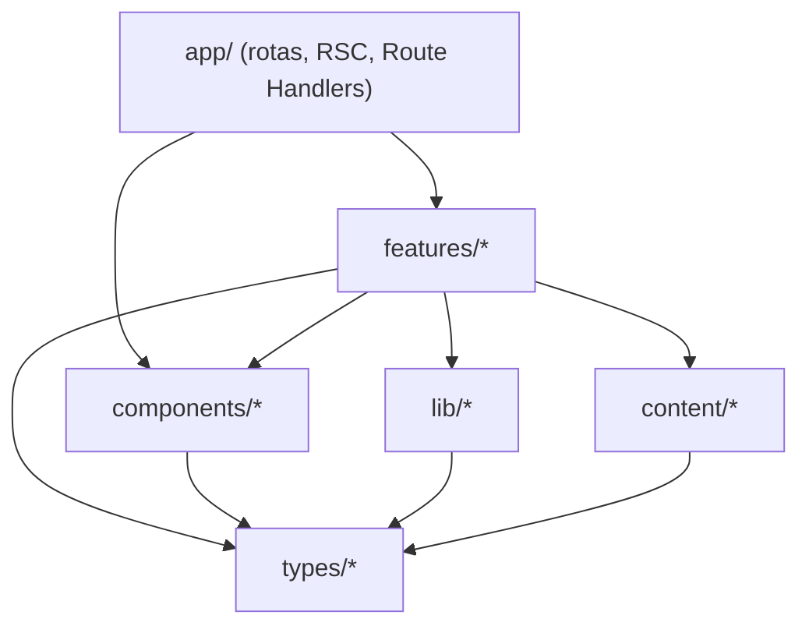
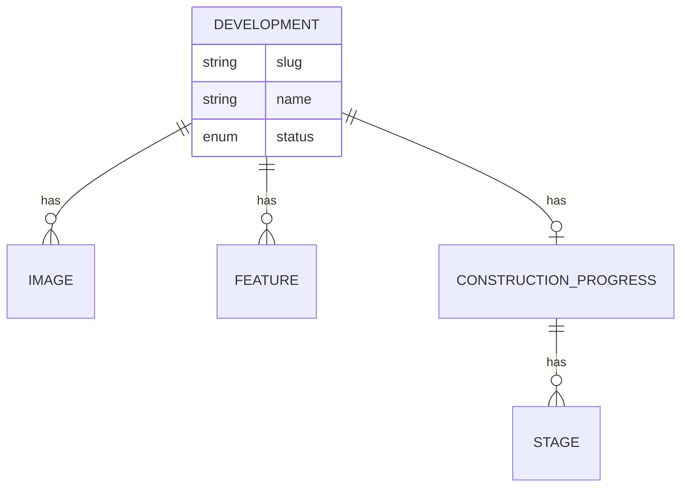

# Architecture Spine — Website Grupo Natus

## Design Paradigm

**Layered feature-based sobre o Next.js App Router.** Server Components são o padrão; Client Components apenas quando há interatividade (filtros, formulários, galeria, WhatsApp). Camadas mapeadas a diretórios:

- `app/` — rotas, layouts, `metadata`, Route Handlers (borda HTTP).
- `features/<domínio>/` — UI + lógica por domínio (developments, contact, engineering, land-submission).
- `components/` — primitivos de UI compartilhados (design system).
- `content/` — conteúdo estático tipado (fonte de verdade dos empreendimentos).
- `lib/` — abstrações de integração e utilidades (WhatsApp, Maps, email, supabase).
- `types/`, `styles/` — tipos e tokens.

A regra de dependência (quem pode depender de quem) está no diagrama em *Invariants & Rules* (AD-1).

## Invariants & Rules

### AD-1 — Direção de dependência em camadas
- **Binds:** `all`
- **Prevents:** ciclos e acoplamento reverso (ex.: um componente compartilhado importando de uma feature).
- **Rule:** o fluxo de importação é unidirecional, conforme o diagrama. `content`/`lib`/`components`/`types` não importam de `features` nem de `app`.



### AD-2 — Empreendimento como dado (não página duplicada)
- **Binds:** FR1, FR2, FR3, FR4, FR14
- **Prevents:** 11 páginas duplicadas; conteúdo divergente entre Home e detalhe.
- **Rule:** todo acesso a empreendimento passa por `content/developments` via `getAllDevelopments()` / `getDevelopmentBySlug()`. Uma página template (`app/empreendimentos/[slug]`) gera as 11 por dados. Slug é identificador único.

### AD-3 — Integrações externas atrás de abstração única
- **Binds:** FR6 (WhatsApp), FR7 (Maps), FR11 (email)
- **Prevents:** número/URL/credencial hardcodados espalhados por componentes.
- **Rule:** cada integração externa vive em um único módulo em `lib/` (`lib/whatsapp`, `lib/maps`, `lib/email`) e é consumida só por ele. Componentes recebem dados/props, nunca chamam o provedor direto.

### AD-4 — Escrita e secrets só no servidor
- **Binds:** FR8, FR9, FR10, FR11, FR15
- **Prevents:** vazamento de secret ao cliente; submissão inconsistente.
- **Rule:** mutações/envios ocorrem em **Route Handlers** (`app/api/**`); formulários fazem POST server-side. Variáveis sensíveis são server-only (sem prefixo `NEXT_PUBLIC_`). Nenhum secret é lido em Client Component.

### AD-5 — Supabase opcional com RLS inviolável
- **Binds:** FR5, FR15, NFR5
- **Prevents:** bypass de RLS; alteração acidental de políticas/segredos existentes.
- **Rule:** Supabase só entra sob necessidade concreta (Gate C). Toda tabela nova tem RLS. **Nunca** remover/alterar RLS, env ou secrets existentes. Acesso server-side via `@supabase/ssr`; a anon key só em leitura pública. Quando um dado migra para o banco, **o banco passa a ser a única fonte de verdade** daquele dado — o `content` deixa de duplicá-lo (evita dois donos do mesmo dado, ex.: progresso). `[ADOPTED]`

### AD-6 — Cada rota é dona do seu SEO
- **Binds:** FR14
- **Prevents:** metadata divergente/duplicada entre páginas.
- **Rule:** cada rota exporta `metadata`/`generateMetadata` (API do Next); a metadata por empreendimento é derivada do `content`. `sitemap.ts` e `robots.ts` na raiz de `app/`.

### AD-7 — Estilo só via design tokens
- **Binds:** FR (todas as UI), NFR2, NFR4
- **Prevents:** drift da identidade Natus por cores/spacing ad-hoc.
- **Rule:** toda estilização deriva dos tokens (Tailwind v4 `@theme` em `styles/`). Proibido valor de cor/tipografia fora dos tokens.

### AD-8 — TDD com cobertura mínima
- **Binds:** `all`, NFR9
- **Prevents:** código sem teste; regressões.
- **Rule:** testes colocados (`*.test.tsx`/`*.test.ts`), red→green→refactor; `vitest.config` fixa `coverage.thresholds` = 90% (lines/functions/branches/statements). O Stop hook `.claude/hooks/coverage-gate.sh` reforça. `[ADOPTED]`

## Consistency Conventions

| Concern | Convention |
| --- | --- |
| Naming | Componentes/tipos `PascalCase`; arquivos de rota conforme Next (`page.tsx`, `layout.tsx`, `route.ts`); slugs `kebab-case`; features em `kebab-case`. |
| Data & formats | Datas em ISO 8601 (`updatedAt`); `status` ∈ `lancamento \| em_construcao \| pronto`; erros de API como `{ error: { code, message } }`; conteúdo faltante = `TODO: CONTENT REQUIRED`. |
| State & cross-cutting | Mutação só server-side (AD-4); config/env via `lib/env` (server-only validado); WhatsApp/Maps/email só via `lib/*` (AD-3); i18n textual em Português. |

## Stack

| Name | Version |
| --- | --- |
| Next.js (App Router) | 16.3.5 `[INSTALLED]` |
| React | 19.3.x `[INSTALLED]` |
| TypeScript | 6.0.x (strict) `[INSTALLED]` — spine pinava 5.x; npm resolveu 6.x em 2026-09 |
| Tailwind CSS | 4.3.3 `[INSTALLED]` (via `@tailwindcss/postcss`) |
| Vitest + Testing Library | 5.0.1 + RTL 16 + jsdom 29 `[INSTALLED]` |
| ESLint | 9.39 + `eslint-config-next` 16.3.5 (flat config nativo) `[INSTALLED]` |
| @supabase/supabase-js + @supabase/ssr | 2.x `[ASSUMPTION]` (Epic 8) |
| Email (Resend) | latest `[ASSUMPTION]` (Epic 5) |
| Starter | **Scaffold manual** (não `create-next-app`) — controle fino do Vitest/coverage e da estrutura top-level do spine. `[RESOLVED]` |

## Structural Seed

```text
natus-website/
  app/
    layout.tsx                 # shell: header/footer/nav + WhatsApp
    page.tsx                   # Home / catálogo (FR1, FR2)
    empreendimentos/[slug]/    # template de empreendimento (FR3, FR4, FR7)
    engenharia/                # FR12
    quem-somos/                # FR13
    negocie-seu-terreno/       # FR10
    contato/                   # FR8
    api/                       # Route Handlers: leads/contato/email (FR11)
    sitemap.ts  robots.ts      # FR14 site-wide
  features/
    developments/              # cards, filtros, galeria, progresso (FR1-5)
    contact/                   # formulários + interesse (FR8, FR9)
    engineering/               # FR12
    land-submission/           # FR10
  components/                  # Button, Badge, Card, Image, Modal, WhatsAppButton...
  content/developments/        # 11 empreendimentos (fonte de verdade) — AD-2
  lib/                         # whatsapp, maps, email, supabase, env — AD-3/4/5
  types/                       # Development, ConstructionProgress
  styles/                      # tokens Tailwind v4 @theme — AD-7
```



## Capability → Architecture Map

| Capability / Area | Lives in | Governed by |
| --- | --- | --- |
| Home / catálogo + filtros (FR1, FR2) | `app/page.tsx`, `features/developments` | AD-2, AD-7 |
| Página de empreendimento (FR3, FR4) | `app/empreendimentos/[slug]`, `features/developments` | AD-1, AD-2 |
| Progresso de obra (FR5) | `features/developments`, `types` | AD-2, AD-5 |
| WhatsApp (FR6) | `lib/whatsapp`, `components/WhatsAppButton` | AD-3 |
| Localização/Maps (FR7) | `lib/maps` | AD-3 |
| Formulários + email (FR8-11) | `features/contact`, `features/land-submission`, `app/api`, `lib/email` | AD-4 |
| Institucionais (FR12, FR13) | `app/engenharia`, `app/quem-somos` | AD-7 |
| SEO (FR14) | rotas + `sitemap.ts`/`robots.ts` | AD-6 |
| Admin/persistência (FR15) | `lib/supabase`, `app/admin` (condicional) | AD-4, AD-5 |

## Deferred

- **Estrutura interna de cada `feature/`** — dona do código quando existir (não fixar agora).
- **Modelo relacional detalhado no Supabase** — só no Gate C (Epic 8); shape em `types` até lá.
- **Estratégia de Maps interativo (API key/custo)** — decidir no Epic 3; começar por embed/link.
- **Provedor de email definitivo e anti-spam** — confirmar no Epic 5 (Resend é `[ASSUMPTION]`).
- **Estratégia de mídia pesada (vídeos/panoramas)** — dimensionar quando houver assets reais.
- **CDN/host/deploy** — fora de escopo por ora (validação 100% local).
